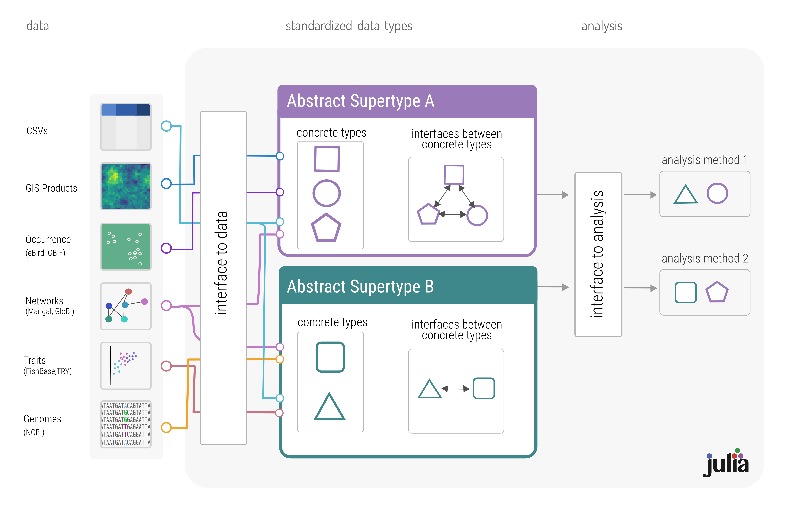

# Introduction

Ecological data is often difficult to access and reuse [@Poisot2019EcoDat;
@Gonzalez2015ActSta]. Macroecological data is, by definition, collected across
scales which necessitate collaboration across more individuals than can feasibly
coordinate with one-another. Yet assimilation of this data is necessary, both to
better understand Earth's macroecology and biogeography, but also to mitigate
the effects and anthropogenic change on biodiversity and its benefits to
humanity [@Giron-Nava2017QuaArg]. Many sources of ecological, evolutionary, and
environmental data exist, but synthesizing this data into a single product
suitable for analysis often remains tedious as data are not in formats that can
be easily combined or interfaced. Here we propose that we can solve this problem
through standardization [@Zimmerman2008NewKno]---developing a schema such that
data collected in a variety of contexts can be assimilated while minimizing the
overhead of data cleaning and wrangling.

Here, we argue a common representation of ecological data will have three
primary benefits: it will **1**)  enable new forms of analysis by making it
easier to combine data from different sources [@Heberling2021DatInt], **2)**
enable continuous integration of new data for next-generation biodiversity
monitoring [@Kuhl2020EffBio], and **3)** aid in open sharing and
reproducability of published results [@Borregaard2016MorRep;
@Zimmerman2008NewKno]. We then briefly review approaches to data standardization
developed in other fields of study, in order to learn what makes an open
standard succeed in promoting data sharing, and what doesn't.  Based on the
properties of good standard we identify, we propose building an open stand then
propose building a living standard for ecological data in the `Julia`
programming language, and argue this is necessary to the three primary benefits
of standardization mentioned earlier.

# A brief history of data standards

Sharing data is fundamental to the scientific method, and standardization of
data enables collaboration among scientists who may never otherwise interact.
Many fields have succeeded in standardizing data by defining a common file
format. There are too many examples to count. To start with the familiar,
standardization of genomic sequences (as `FASTA` files), and the
data directly from next-gen sequencing machines, have enabled the flourishing of
genomics as a field of study, enabling data aggregation at scales that seemed
impossible not that long ago [@Kahn2011FutGen]. In astronomy, the `FITS` format (maintained
by NASA GSFC) similarly enabled sharing data from differently designed telescopes
around the world. Open standards have enabled the growth of automated data
processing outside the sciences as well---the modern internet would be
impossible without HTTP and IP standards. This highlights how standardization of
data enables automation because there is no ambiguity in what is being sent and
received between clients.

In some cases standardization does not unify, but instead produces many
competing standards. For example, in GIS, there are themselves too many
standards too count, in part because this data takes on different forms (raster
or vector). This leads to the "15 standards" problem summarized in @fig:xkcd.
This was partially solved by Geospatial Data Abstraction Libary [GDAL; @GDAL], a
software library for interfacing with different formats of geospatial data. This
enabled conversion between a large number of legacy data types and `GeoTIFF`,
and in part led to `GeoTIFF`'s  increasing ubiquity  

{#fig:xkcd}

The primary take-aways are that good standards are unambiguous, open and free to
implement, able to change over time without breaking backward compatibility.
Standards tend to become widely adopted with the support of institutions (FASTA,
FITS), which can be enabled by requiring data available in standardized format
prior to publication (e.g. FASTA sequences made available on NCBI for most
journals in genomics). To avoid the "15 standards" in @fig:xkcd, when developing
a standard it must be _extendable_, such that building onto an existing standard
is always easier than building a new one, while not altering the behaviour of
the original standard. Defining using software to enable "living standards" (a
la GDAL) enables this extendability, and makes standards more flexible. Further,
this is best enabled when this development is democratic and open source.

# Using `Julia` to define living data standards

Why has standardization proven difficult in ecology? The are no fixed set of
variables used in ecological studies, and there are good reasons to use
different formats to represent the same data depending on context. The EML
format has been proposed [@Jones2019EcoMet] to solve this problem, yet for
the reasons explored in the previous section, standardization through
file-format faces challenges when faced with the variability of
macroecological data.

We propose defining a living standard for ecological data within the `Julia`
programming language. `Julia` learns the lessons of object-oriented languages, and enables building
hierarchies of abstract and concrete types without the heavyhanded type syntax of
lower level objected-oriented languages. How do we define a standard using this
type system? Different distinct category of information (e.g. location, species,
environmental variables, and so on) is a subtype of a corresponding abstract
supertype (e.g. `AbstractLocation`, `AbstractSpecies`,
`AbstractEnvironmentalVariable`). Then, we define concrete types for each of the
different ways you can represent a given information (@fig:concept).

{#fig:concept}

As an example, consider the increasingly ubiquitous case of attempting to
associate climate data (derived from WorldClim, CHLSEA, or similar) with species
occurrence data [@Dansereau2021SimJl]. Both observations contain information
about a `AbstractLocation`. However, if the climate data is in a raster format,
and the locations are in coordinates, we could define concrete types
`RasterLocation` and `CoordinateLocation`, both of which are subtypes of
`AbstractLocation`. Some methods of analysis might want this data in the form of
`RasterLocation`s. Others might want `CoordinateLocation`s. If the standardized
type defines an interface between `RasterLocation` and `CoordinateLocation`,
then it doesn't matter what the original type of data you pass into the analysis
method, it can convert it to the proper type (see analysis panel of @fig:concept).

`Julia` is an ideal candidate for this, in large part, due to its type system.
However `Julia` serves to become the future of computing in biodiversity
science. It is a modern language designed for high-performance scientific
computing with expressive syntax that feels like writing high-level
interpreted languages (e.g. Python, R, MATLAB) but with C-like speed. `Julia`
has built-in tools for testing, distributed computing on CPUs and GPUs, and a
package manager and ecosystem with state-of-the art tools for data science, machine learning [@Innes2018FluEle; @Turing], simulation [@Harris2021EcoJl], and
visualization.

Using standardized types as a bridge between data and analysis is how we create
an open standard for ecological data. This splits the processes of data
aggregation and data analysis into discrete parts. Integrating either data from
a particular study, or a new database, is as simple as implementing the
interface from the data source to the standardized types. Data from individual
studies could be incorporated into public repositories containing both the raw
data and the interface to Julia data structures, and this combined
data/interface package is all that is needed to either reproduce the results or
incorporate that data into a larger data assemblage. This will make combining
data from multiple sources easier, and yield benefits for the development and
implementation of novel methods, as the analysis code becomes separate from the
data source. In turn, this will enable specialization in development of analysis
tools that can be scaled to meet the needs of next-generation biodiversity
monitoring. The term "ecosystem" is often used metaphorically to describe a set
of software tools that work together. Toward a modern set of tools for
macroecology in `Julia` based around the standardized types we propose. Multiple
trophic-levels of packages in `Julia`. Modular tools that enable arbitrarily
complex analysis pipelines.

# References
