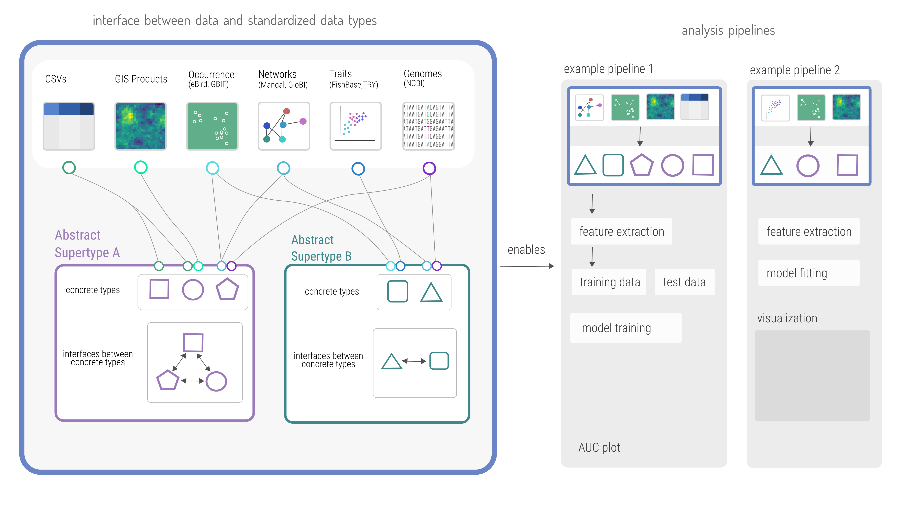

# Introduction

Ecological data is often difficult to access and reuse [@Poisot2019EcoDat;
@Gonzalez2015ActSta]. Macroecological data is, by definition, collected across
scales which necessitate collaboration across more individuals than can feasibly
coordinate with one-another. Yet assimilation of this data is necessary, both to
better understand Earth's macroecology and biogeography, but also to mitigate
the effects and anthropogenic change on biodiversity and its benefits to
humanity [@Giron-Nava2017QuaArg].
Many sources of ecological, evolutionary, and environmental data exist, but
but synthesizing this data into a single product suitable for analysis often
remains tedious as data are not in formats that can be easily combined or
interfaced.
Here we propose that we can solve this problem through standardization
[@Zimmerman2008NewKno]---developing a schema such that data collected in a
variety of contexts can be assimilated while minimizing the overhead of data
cleaning and wrangling.

Here, we argue a common representation of ecological data will have three
primary benefits: **1**) it will enable new forms of analysis by making it
easier to combine data from different sources [@Heberling2021DatInt], **2)**
enable continuous integration of new data for next-generation biodiversity
monitoring [@Kuhl2020EffBio], and **3)** aid in open sharing and
reproduceability of published results [@Borregaard2016MorRep;
@Zimmerman2008NewKno].
We then briefly review approaches to data standardization developed in other
fields of study, in order to learn what makes an open standard succeed in
promoting data sharing, and what doesn't.  
Based on the properties of good standard we identify, we propose building an
open stand then propose building a living standard for ecological data in the
`Julia` programming language, and argue this is necessary to the three primary benefits of standardization mentioned earlier.

# A brief history of data standards

Sharing data is fundamental to the scientific method. Standardization of data
enables collaboration among scientists who may never otherwise interact.

Many fields have succeeded in standardizing data by defining a common file
format. There are too many examples to count: the `FASTA` format for
representing genomic sequences (maintained by NCBI), the `FITS` format in
astronomy (maintained by NASA GSFC). This approach has also appeared ecology
[@Jones2019EcoMet]. Open standards have enabled outside the sciences
as well---the modern internet would be impossible without HTTP and IP standards.
We learn that standardization of data enables automation because there is no
ambiguity in what is being sent and received between clients.

In some cases standardization does not unify, but instead produces many competing
standards. For example, in GIS, there are
themselves too many standards too count, `TIFF`, `GeoTIFF`, and so on.
This leads to the "15 standards" problem summarized in @fig:xkcd.

{#fig:xkcd}

The primary take-aways are that good standards are unambiguous, open and free to
implement, able to change over time without breaking backward compatibility.
Standards tend to become widely adopted with the support of institutions (FITS
and Astronomy), which take take the form of requiring  data available in
standardized format prior to publication (e.g. FASTA sequences made available on
NCBI for most genomic studies).
To avoid the "15 standards" in @fig:xkcd, when developing a standard it must be
_extendable_, such that building onto an existing standard is always easier
than building a new one, while not altering the behaviour of the original standard. Further the development of standards over time is a democratic
process where the users of the standard contribute to its change over time.

# Using `Julia` to define living data standards

Why has standardization proven difficult in ecology? Macroecological data is
variable. The are no fixed set of variables used in ecological studies, and
there are good reasons to use different formats to represent the same data
depending on context.

We propose defining the standard within a programming language (Julia). We can
build a standard for ecological data using Julia's type system. Abstract type is
used to cover the same type of information. Concrete types represent the
different ways you can represent that information, with interfaces to change
between them.

As an example, consider the increasingly ubiquitous case of attempting to
associate climate data (derived from WorldClim, CHLSEA, or similar) with species
occurrence data. (cite SDMLayers here). Both observations contain information
about a `AbstractLocation`. However, if the climate data is in a raster format,
and the locations are in coordinates, we could define concrete types that
`RasterLocation` and `CoordinateLocation`, both of which are subtypes of
`AbstractLocation`. Some methods of analysis might want this data in the form of
`RasterLocation`s. Others might want `CoordinateLocation`s. If the standardized
type defines an interface between `RasterLocation` and `CoordinateLocation`,
then it doesn't matter what the original type of data you pass into the analysis
method is, it can convert it to the proper type.

{#fig:concept}

Why else is julia good?

- idiomatic
- high performance
- built in tools for testing
- built in tools for parallelization
- built in package manager
- shorter, more readable, more reusable code than certain competing languages

EcoBase is a package in EcoJulia which enables common representation of
ecological data that represents the same type of information.
Using standardized types as a bridge between data and analysis is how we create
an open standard for ecological data. This splits the processes of data
aggregation and data analysis into discrete parts. Integrating either data from
a particular study, or a new database, is as simple as implementing the
interface from the data source to the EcoBase data types. This will make
combining data from multiple sources easier, and yield benefits for the
development and implementation of novel methods, as the analysis code becomes
separate from the data source (see fig. 1). In turn, this will enable
specialization in development of analysis tools that can be scaled to meet the
needs of next-generation biodiversity monitoring. Published data can be
incorporated into public repositories containing both the origin data and the
interface to transform it into Julia data structures, and this combined
data/interface package is all that is needed to either reproduce the results or
incorporate that data into a larger data assemblage.

The term "ecosystem" is often used metaphorically to describe a set of software tools that work together.

trophic levels of dependencies for ecojulia

# References
